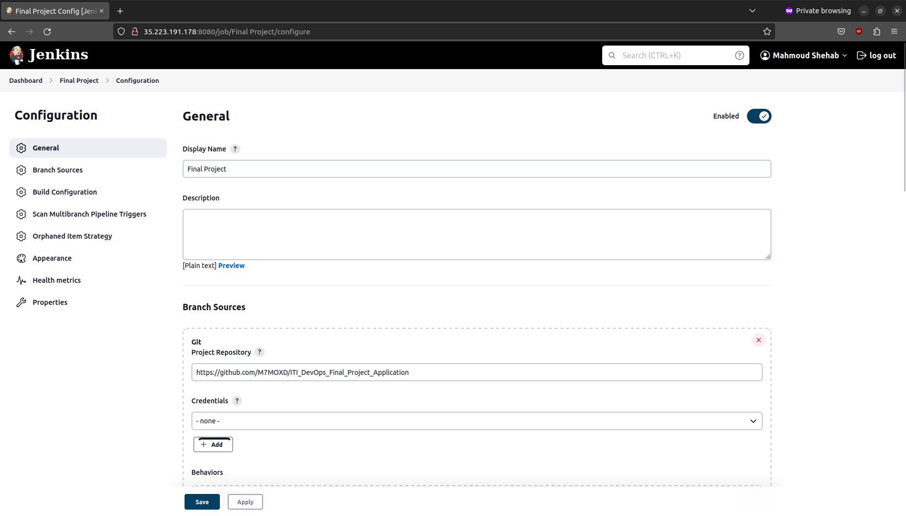

# GKE Infrastucure with Terraform

## Tools:

- gcloud cli
- Terraform
- Docker

## How to Use:

### Local Steps:

- Clone the repository
- Make sure you have installed gcloud cli, Terraform and Docker
- Authenticate your user by running
  `gcloud init`
- Navegate to the Terraform diorectory and initialize it by running
  `terraform init`
- Make the nessasery change in the provider.tf file (project name, region)
- Run `terraform plan` to review the infrastucure
- After reviewing the infrastucure run `terraform apply`

### Cloud Steps:

- run `gcloud compute ssh --zone "<your zone>" "my-instance" --tunnel-through-iap --project "<you project name>"` to ssh into the instance
- install kubectl and gke-gcloud-auth-plugin by running

  ```
  curl -LO "https://dl.k8s.io/release/$(curl -L -s https://dl.k8s.io/release/stable.txt)/bin/linux/amd64/kubectl"
  sudo install -o root -g root -m 0755 kubectl /usr/local/bin/kubectl
  sudo apt-get install google-cloud-sdk-gke-gcloud-auth-plugin
  ```

- After installing the tools on the instance run

  ```
  gcloud container clusters get-credentials my-gke --region <your region> --project <your project name>
  ```

- Copy the Setup files into the instance
- run `kubectl create ns devops-tools`
- run
  ```
  kubectl apply -f Setup/serviceAccount.yml
  kubectl apply -f Setup/volume.yml
  kubectl apply -f Setup/deployment.yml
  kubectl apply -f Setup/service.yml
  kubectl apply -f Setup/Agent/agent.yml
  kubectl apply -f Setup/Agent/agent_svc.yml
  ```
- run `Kubectl get svc -n devops-tools` to get jenkins ip
- run `Kubectl exec -it po/jenkins-agent-<tail: pod name> -n devops-tools -- bash` to enter jenkins agent shell
- run `passwd jenkins` to make a password for the jenkins user
- run `chmod 666 /var/run/docker.sock` to make docker available to jenkins user
- run `service ssh start` to be able to connect to the agent
- run these command to install gcloud cli

  ```
  echo "deb [signed-by=/usr/share/keyrings/cloud.google.gpg] https://packages.cloud.google.com/apt cloud-sdk main" | tee -a /etc/apt/sources.list.d/google-cloud-sdk.list
  curl https://packages.cloud.google.com/apt/doc/apt-key.gpg | apt-key --keyring /usr/share/keyrings/cloud.google.gpg add -
  apt-get update && apt-get install google-cloud-cli
  apt-get install google-cloud-sdk-gke-gcloud-auth-plugin
  ```

- run `su - jenkins` to switch to jenkins user
- run `gcloud auth configure-docker` to allow docker push to your priavte gcr
- run `gcloud container clusters get-credentials my-gke --region <your region> --project <your project name>` to generate kubeconfig file
- now with the password we created for the jenkins user add the jenkins agent to the list of jenkins node to be able to use it

## Pictures:

### Terraform Apply


### GCP Home


### GCP VPC


### GCP NAT


### GCP IAM


### GCP VMs


### GCP GKE


### GCP Load Balancer


### GCP GCR


### SSH into Instance


### Access the Application


### Access Jenkins





